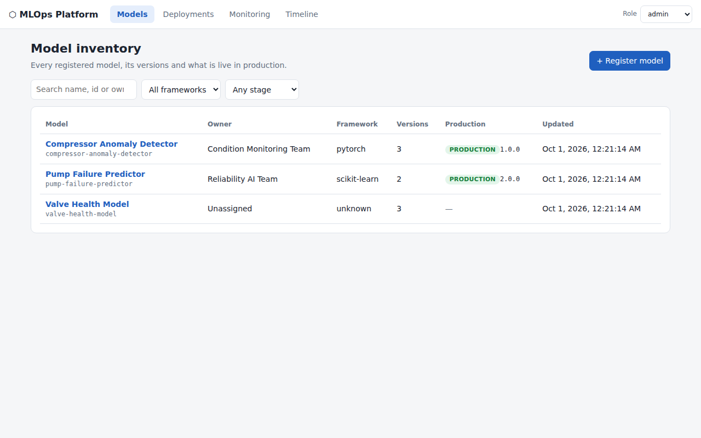
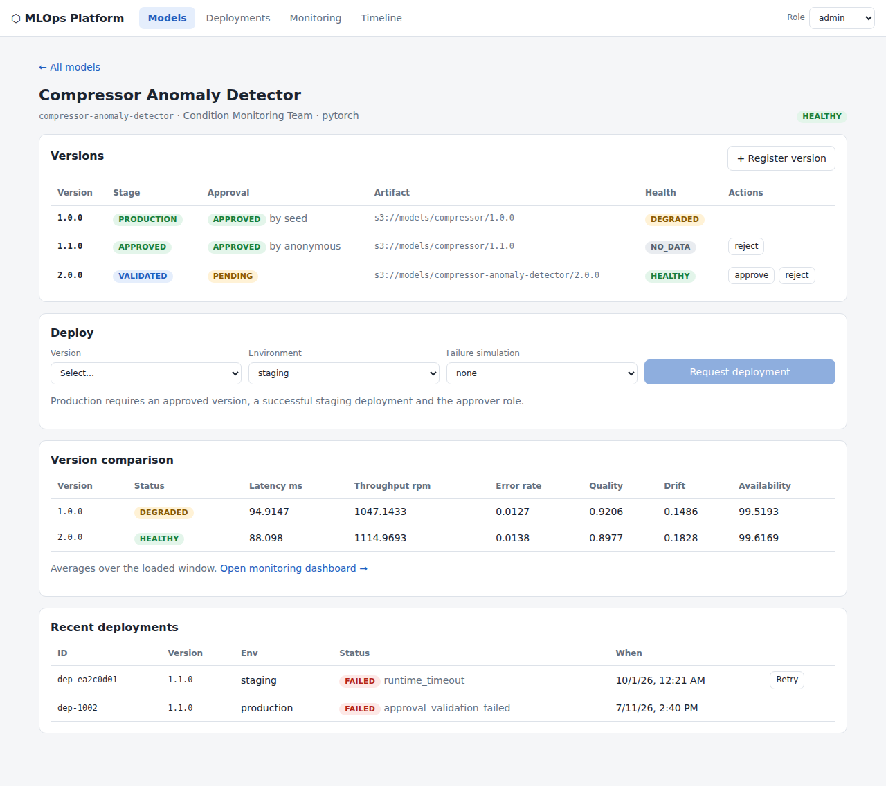
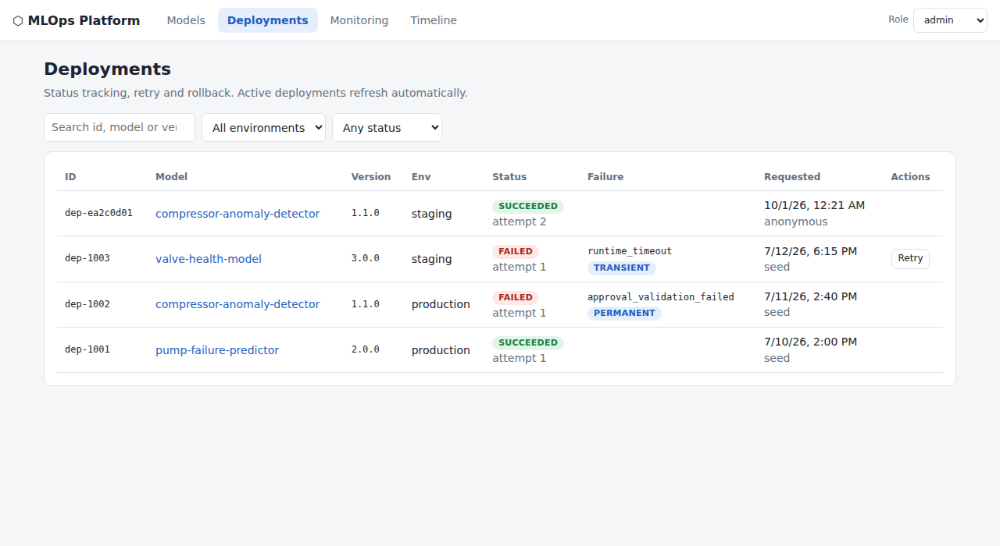
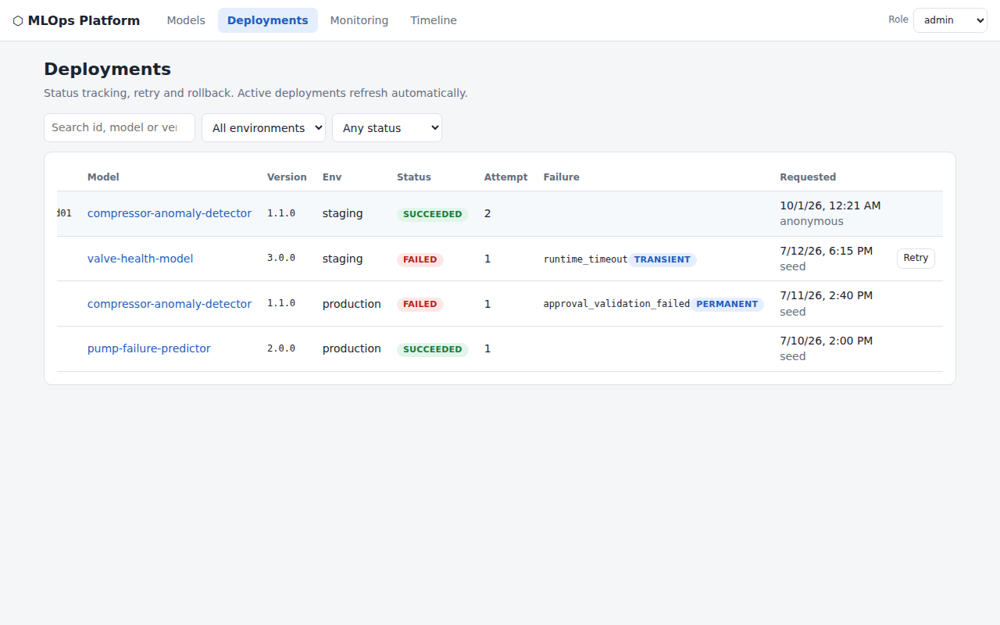
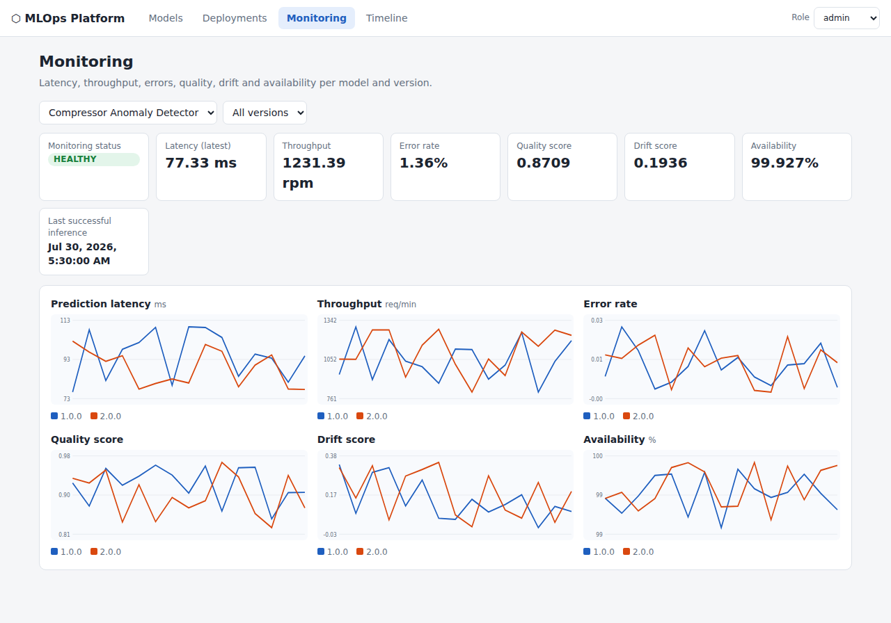
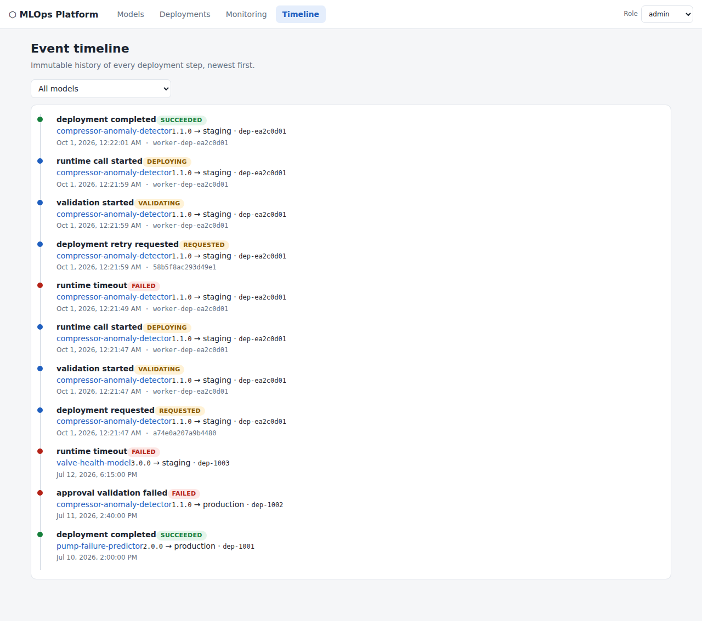
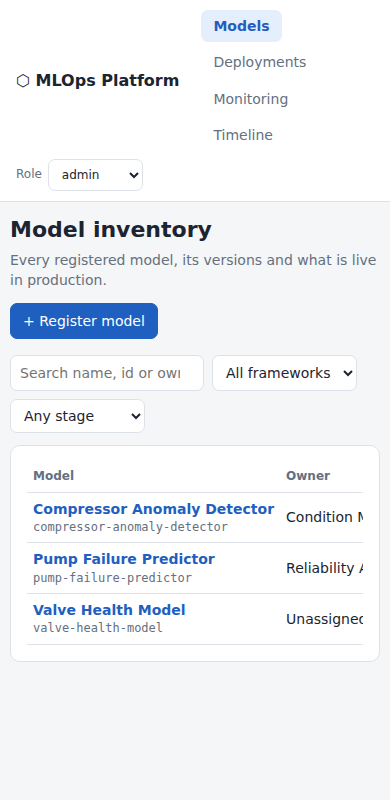
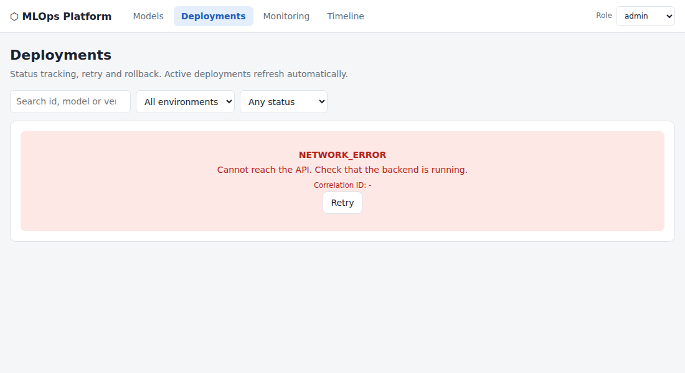

# MLOps Platform - Technical Assignment

**Role level: G12 (Principal Software Engineer / Technical Lead)**

A Python (FastAPI) + Angular control plane to **register, version, approve, deploy, monitor and roll back** ML models, with the G12 architecture, governance, async-processing, observability and leadership artifacts.

## Problem statement
An industrial organisation runs many ML models across plants and environments and needs one governed place to manage their lifecycle. Full analysis, the plan and the design decisions: [`docs/00-problem-statement-and-plan.md`](docs/00-problem-statement-and-plan.md).

## Architecture summary
Modular monolith (ADR-001): `domain` (pure rules) <- `services` <- `api`; an **asynchronous deployment worker** with atomic claim, idempotent runtime calls and a reconciler; Postgres (SQLite for local dev) with a partial unique index guaranteeing one active deployment per model/environment; correlation-id logging, Prometheus metrics, health/readiness; Angular SPA that only talks to `/api`. Diagram: [`docs/architecture-diagram.png`](docs/architecture-diagram.png), details: [`docs/architecture.md`](docs/architecture.md).

## Technology stack
Python 3.11+, FastAPI, Pydantic v2, SQLAlchemy 2, Alembic, PostgreSQL 16 / SQLite, Pytest; Angular 20 (standalone components, signals, RxJS), TypeScript; Docker, Docker Compose, GitHub Actions.

## Run it
```bash
docker compose up --build          # UI http://localhost:4200  API docs http://localhost:8000/docs
```
Local without Docker:
```bash
make install
make run                            # backend :8000 (SQLite, sample data auto-seeded)
cd frontend && npm start            # UI :4200, proxies /api -> :8000
bash scripts/demo.sh                # scripted acceptance walk-through against the API
```
Use the **Role** selector in the UI header (viewer / engineer / approver / admin); production deployment needs `approver`+.

## Tests
```bash
make test               # backend (50 tests, 92% coverage) + frontend (10 tests)
make test-backend       # cd backend && python -m pytest --cov=app
make test-frontend      # cd frontend && npx ng test --watch=false --browsers=ChromeHeadlessCI
```
Strategy: [`docs/test-strategy.md`](docs/test-strategy.md).

## API documentation
Swagger `http://localhost:8000/docs`, ReDoc `/redoc`, contract `/openapi.json`; summary table in [`docs/api-design.md`](docs/api-design.md).

## Acceptance scenarios (all covered by automated tests)
1 register model + 2 versions - 2 approve - 3 unapproved version blocked from production (`VERSION_NOT_APPROVED`) - 4 deploy approved version (staging -> production) - 5 monitoring in Angular - 6 retry failed deployment (transient) - 7 roll back production - 8 duplicate requests handled safely (Idempotency-Key + DB constraint) - 9 API failures shown with code + correlation id - 10 automated tests.

Failure simulation: request a deployment with `simulate_failure = transient` (fails first attempt with `runtime_timeout`, retry succeeds) or `permanent` (`runtime_rejected`, not retryable).

## Screenshots
| | |
|---|---|
|  |  |
|  |  |
|  |  |
|  |  |

## Sample workflow
1. Models -> *Compressor Anomaly Detector* -> version 1.1.0 `validate` then `approve` (as approver/admin).
2. Deploy 1.1.0 to `staging` with *transient* failure simulation -> Deployments shows `FAILED / runtime_timeout / TRANSIENT`.
3. **Retry** -> `SUCCEEDED` (attempt 2). Deploy to `production`, then **Roll back** -> previous version restored, timeline shows the full history.

## G12 deliverables
[Architecture](docs/architecture.md) - [ADR-001..004](docs/adr) - [Answers to the 10 G12 questions](docs/g12-questions.md) - [Observability and dashboard proposal](docs/observability.md) - [Delivery plan](docs/delivery-plan.md) - [Risk register](docs/risk-register.md) - [Roadmap](docs/roadmap.md) - [Code-review and production-readiness checklists](docs/checklists.md) - [Kubernetes view](deploy/k8s/app.yaml) - [Known limitations](docs/known-limitations.md)

## Findings in the provided sample data (handled, see limitations)
Metrics/events reference versions missing from the registry file; `dep-1002` shows an unapproved version sent to production (approval gate); `dep-1003` is a transient failure whereas `dep-1002` is permanent (drives retry policy); stage and approval are independent facts; the seed compose published the DB port with default credentials and had no worker.

## Future improvements
See [`docs/roadmap.md`](docs/roadmap.md).
