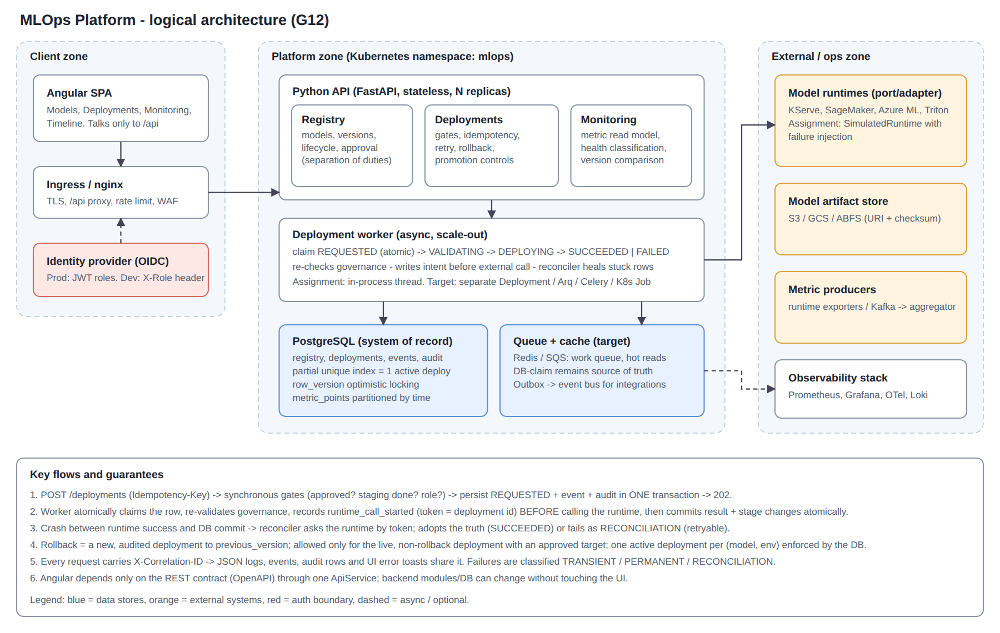

# Architecture

## Live state, governance and runtime (post-review)
- **Authentication**: `AUTH_MODE=jwt` validates signature, expiry, issuer and audience on every route except `/health` and `/ready`; identity is `sub`, role a claim; header identity is ignored. `ENVIRONMENT=production` runs `validate_production` at API and worker start-up. `/metrics` can require `METRICS_TOKEN`. See ADR-005.
- **Completion-time governance**: `_succeed` locks the version row and re-validates approval/stage inside the finalising transaction. If governance changed during the runtime call the deployment fails permanently (`approval_revoked_during_deploy`), the runtime call is compensated with `undeploy`, and the live pointer never moves. `reject/archive/withdraw` are refused while a deployment of that version is VALIDATING/DEPLOYING (`VERSION_IN_USE`).
- **Late completions**: a timed-out call may still finish remotely. The reconciler sweeps recent `runtime_timeout` failures: a superseded one is undeployed, an unsuperseded one is flagged for retry (which adopts via `lookup`). A periodic drift check compares `EnvironmentState` with the runtime. Not built: per-environment fencing generations.
- **Database invariants**: CHECK constraints on stage/approval/status/environment, `stage IN (STAGING, PRODUCTION) => approval = APPROVED`, at most one PRODUCTION version per model (partial unique index), composite FKs from deployments and environment state to versions, 64-bit keys on events/audit/metrics. See ADR-006.
- **Runtime selection**: `RUNTIME_ADAPTER=simulated|http`; the HTTP adapter implements a documented REST contract (deploy, lookup, status, undeploy, verify_artifact) and is tested against a mock transport only.
- `EnvironmentState(model_id, environment)` is the source of truth for what is live, updated in the same transaction as a deployment result; stale retry/rollback attempts are refused against it.
- Governance: four-eyes approval, `WITHDRAWN` stage, reject allowed from STAGING, denied attempts audited as `*.denied`, optional validation-gate fields, artifact checksum + store allowlist.
- Worker: per-call runtime timeout, concurrent worker pool, idempotency token = deployment id, reconciler covers DEPLOYING and VALIDATING.
- Identity is normalised (trim + casefold). Artifact checksum is required for production and verified through the runtime port (`verify_artifact`).
- Kubernetes: Ingress -> frontend (unprivileged nginx, `API_UPSTREAM` env) -> `api` Service; NetworkPolicies allow ingress->frontend, frontend->api, Prometheus->api/worker, and DNS/DB/runtime egress for api, worker and the migrate Job.
- Monitoring adds a STALE status for old data. Import-linter enforces domain purity and that services never import the HTTP layer.

## Context
Many ML models run across plants and environments. Teams need one control plane to register, version, approve, deploy, monitor and roll back models. The platform is a *control plane*: it does not serve predictions, it governs and orchestrates the runtimes that do.

## Scope
In scope: registry, lifecycle governance, deployment orchestration, monitoring read-model, audit, operator UI. Out of scope (see `known-limitations.md`): training pipelines, feature store, real runtime adapters, SSO integration, metric ingestion at scale.

## Architecture overview
A modular monolith with hard internal boundaries, deployable as N stateless API replicas plus N workers. It was chosen over microservices deliberately (ADR-001): one team, one transactional consistency boundary (approval + stage + deployment + audit must commit atomically), and no independent scaling need yet.

## Components
| Module | Owns | Code |
|---|---|---|
| Domain | Pure rules: lifecycle, deployment FSM, failure classification. No I/O. | `app/domain` |
| Registry | Models, versions, approval, lifecycle actions | `app/services/registry.py` |
| Deployments | Gates, idempotency, retry, rollback, listing | `app/services/deployments.py` |
| Worker | Async execution, atomic claim, reconciler | `app/workers` |
| Runtime port | `ModelRuntime` protocol; `SimulatedRuntime` adapter | `app/workers/runtime.py` |
| Monitoring | Metric read model, health thresholds, version comparison | `app/services/monitoring.py` |
| Audit | Immutable who/what/when + correlation id | `app/services/audit.py` |
| API | FastAPI routers, Pydantic schemas, error envelope, middleware | `app/api`, `app/main.py` |
| UI | Angular SPA; one `ApiService` is the only backend-aware class | `frontend/src/app` |

Dependency rule: `api -> services -> domain`, `workers -> services/domain`, nothing depends on `api`. The domain package imports nothing from SQLAlchemy/FastAPI, so the rules are unit-tested in microseconds.

## Domain model
`Model 1-* ModelVersion` (stage + approval status are **separate facts**), `Model 1-* Deployment 1-* DeploymentEvent`, `AuditLog` (append-only), `MetricPoint` (high-volume, time-partitioned).

Version lifecycle: `DRAFT -validate-> VALIDATED -approve-> APPROVED -deploy staging-> STAGING -deploy prod-> PRODUCTION -superseded-> ARCHIVED`. `reject` returns to `DRAFT`. A rollback restores an `ARCHIVED` version to `PRODUCTION` and moves the bad one to `VALIDATED` with approval `PENDING` (re-approval required).

Deployment FSM: `REQUESTED -> VALIDATING -> DEPLOYING -> SUCCEEDED | FAILED`; `SUCCEEDED -> ROLLED_BACK`; `FAILED -> REQUESTED` (retry only). Illegal transitions raise `INVALID_TRANSITION`.

## Key workflows
**Deploy.** Synchronous gates (role, approval, stage, staging-first, duplicate/conflict) -> one transaction writes `REQUESTED` + event + audit -> `202`. Worker claims with an atomic `UPDATE ... WHERE status='REQUESTED'`, re-validates governance (approval may have been revoked), writes `runtime_call_started`, calls the runtime with an idempotency token equal to the deployment id, then commits status + version stages + event + audit in one transaction.

**Retry.** Only `FAILED` with class `TRANSIENT` or `RECONCILIATION` and `attempt < max`. `PERMANENT` failures (approval, artifact, runtime rejection) are never auto-retried; unknown reasons default to `PERMANENT` (fail safe).

**Rollback.** Creates a new deployment back to `previous_version`. Refused unless: the deployment is `SUCCEEDED`, is the *live* one for that model/environment (else `STALE_ROLLBACK`), is not itself a rollback (`ROLLBACK_OF_ROLLBACK`), has a previous version (`ROLLBACK_TARGET_MISSING`) that is still approved (`ROLLBACK_TARGET_UNSAFE`). Repeating the request returns the same rollback (idempotent).

## Reliability
- Idempotency: `Idempotency-Key` header + request hash (same key, different body -> `IDEMPOTENCY_KEY_REUSED`); natural-key dedupe for clients without a key; unique index resolves races.
- Concurrency: partial unique index `uq_active_deployment (model_id, environment) WHERE status IN (active)` makes "two promotions at once" impossible at the database; `row_version` optimistic locking on versions and deployments returns `409 CONCURRENT_UPDATE`.
- External success / DB failure: intent is persisted before the external call; the reconciler adopts the runtime's truth for rows stuck in `DEPLOYING` (tested).
- Worker crash safety: claims are atomic; unfinished `DEPLOYING` rows are reconciled; steps are idempotent.

## Security
RBAC with four roles (`viewer < engineer < approver < admin`) enforced server-side in services, never only in the UI. Separation of duties: engineers register/validate/deploy non-prod, **approvers** approve and deploy/rollback in production. In the assignment the role arrives as `X-Role`; production replaces `get_actor` with OIDC JWT validation (claims -> role) behind the ingress. Secrets come from env/secret store; `.env` is git-ignored; DB port is not published in compose. Every mutating call is audited with actor, role and correlation id.

## Observability
JSON structured logs with correlation id (`X-Correlation-ID` accepted or generated, echoed, stored on events/audit, shown in UI error toasts); Prometheus-format counters at `/metrics`; `/health` (liveness) and `/ready` (DB + worker). Failure classification is a first-class field. Dashboard proposal and alerts: `observability.md`.

## Scaling
See `g12-questions.md` (Q1, Q6). Summary: stateless API behind an HPA; DB-claimed work queue first, broker later; read replicas + cache for inventory; time-partitioned metric tables with downsampled rollups; separate metric ingestion path.

## Kubernetes view
`deploy/k8s/` holds a reference set: `api` Deployment (N replicas, readiness `/ready`, liveness `/health`, PDB, HPA), `worker` Deployment (same image, `WORKER_ENABLED=true`, API replicas run with it disabled), `frontend` Deployment + Service, `Ingress` with TLS, Postgres as a managed service (RDS/Cloud SQL), Secrets from the cluster secret store, migrations as a pre-upgrade `Job`.

## Trade-offs and rejected alternatives
| Decision | Chosen | Rejected | Why |
|---|---|---|---|
| Service shape | Modular monolith | Microservices per module | Single transactional boundary, one team, lower ops cost (ADR-001) |
| Deployment execution | DB-claimed async worker | Synchronous call in request; Celery now | Sync ties latency/availability to the runtime; broker adds infra before it is needed (ADR-002) |
| Duplicate protection | Idempotency key + DB constraints | App-level locks | Locks do not survive multiple replicas |
| Rollback | New audited deployment | Mutating the old row | Preserves history and lets rollback use the same safety pipeline (ADR-003) |
| Stage vs approval | Two fields | One status | Stage answers "where", approval answers "allowed" (sample data proves they differ) |
| Metrics store | Relational, partitioned | Time-series DB now | Adequate to ~10^8 rows; TSDB/ClickHouse is a roadmap item (ADR-004) |
